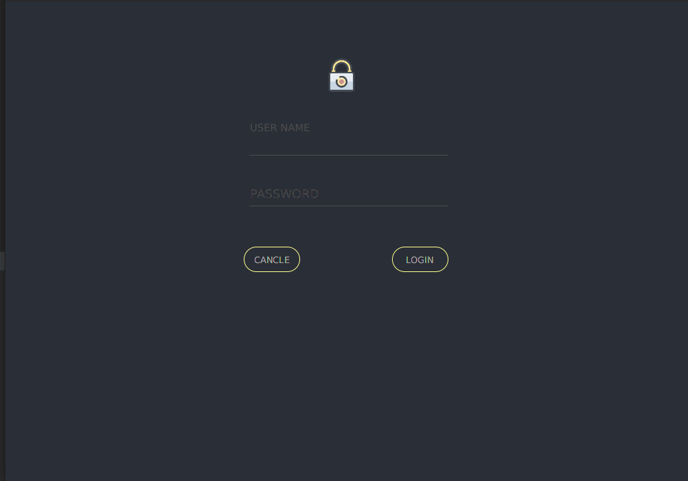
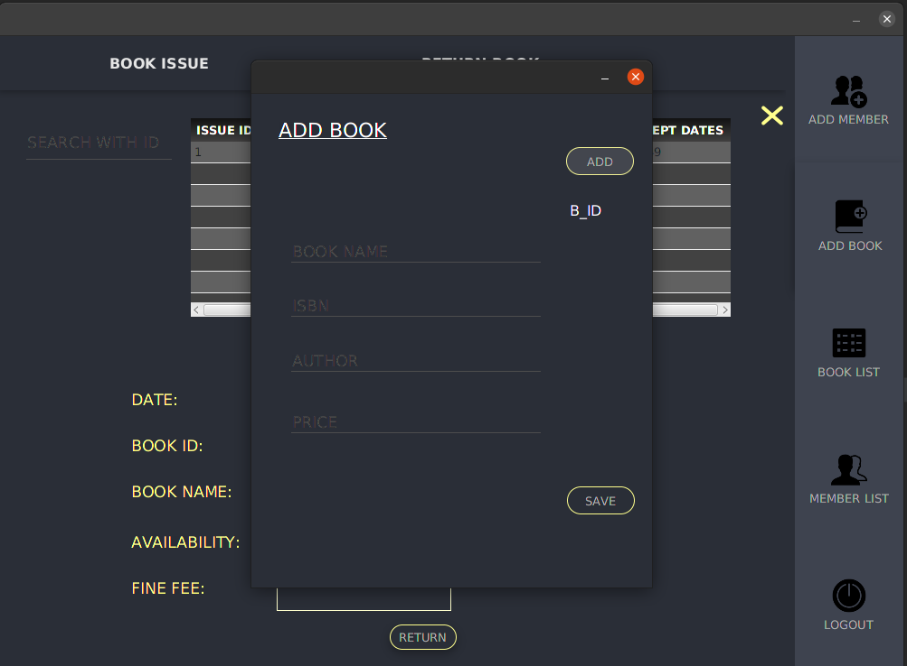
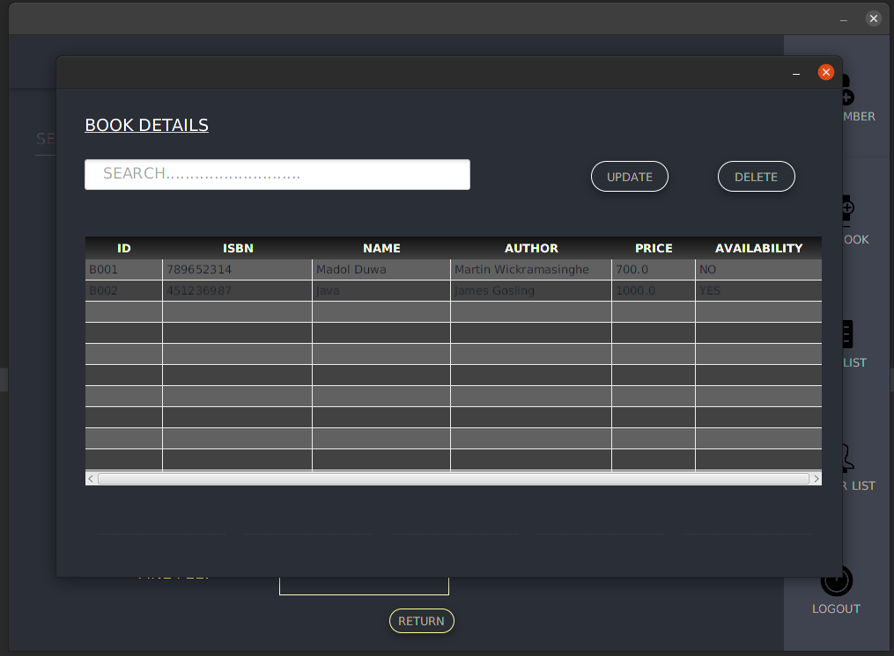
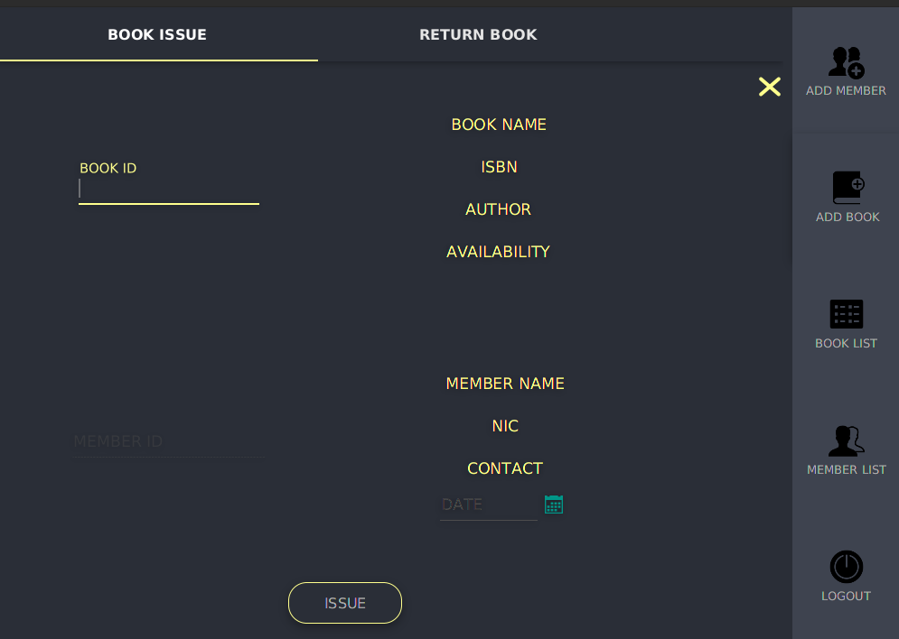
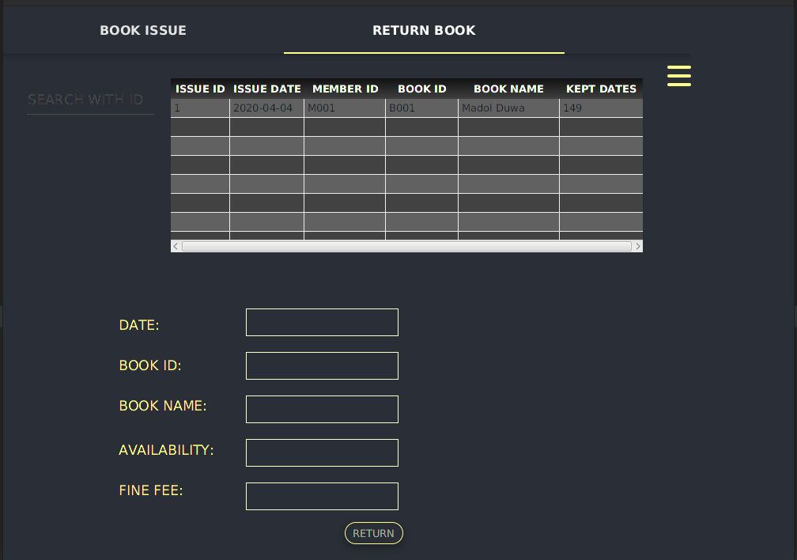
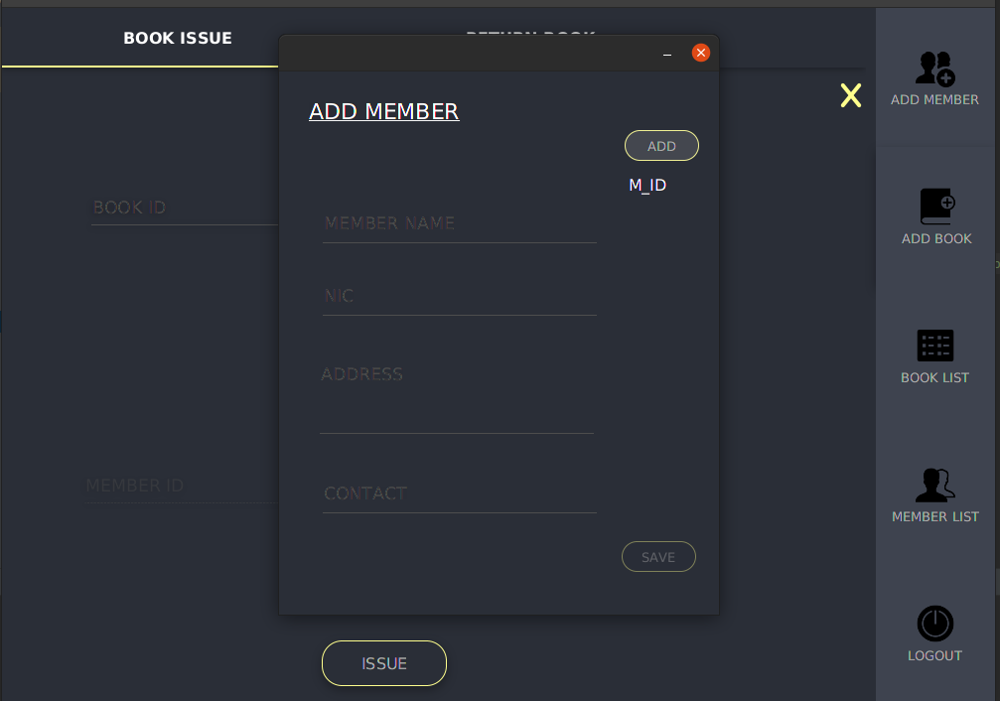
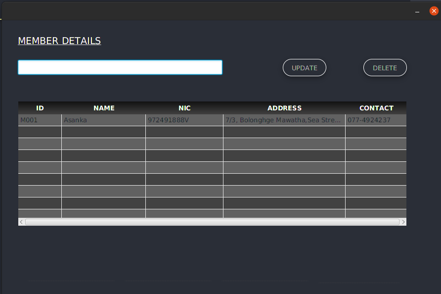

# Library Management System

## Introduction

Library Management System using Java and JDBC with MySQL.

#### Login

#### Book Management

#### Member Management

## Requirements

* Before use this application you must need to install [JAVA](https://www.oracle.com/java/technologies/javase/javase-jdk8-downloads.html) runtime environment and [MYSQL](https://www.mysql.com/) database management services.

#### Required JAR files
* [JFoenix](http://www.jfoenix.com/) - is an open source Java library, that implements Google Material Design using Java components
* [FontAwesomeFX-8.2](https://bitbucket.org/Jerady/fontawesomefx/downloads/) - FontAwesomeFX is an open source library adding Web Icons support to your JavaFX Apps! Including FontAwesome, WeatherIcons, Google Material Icons.
* [MySQL Connector](https://dev.mysql.com/downloads/connector/j/) - MySQL Connector/J is the official JDBC driver for MySQL.

## Installation

 1. Clone or Download the repository.
 2. Download the required library files.
 3. Create a lib file inside the project directory and copy those jar files into that.
 4. Find Database Configuration From src/dbConnection, and set your Database name,user name and password.
 5. Test it!.
 
## Contributing
Pull requests are welcome. For major changes, please open an issue first to discuss what you would like to change.
Please make sure to update tests as appropriate.

## License
Distributed under the MIT License. See [License](LICENSE) for more information.
